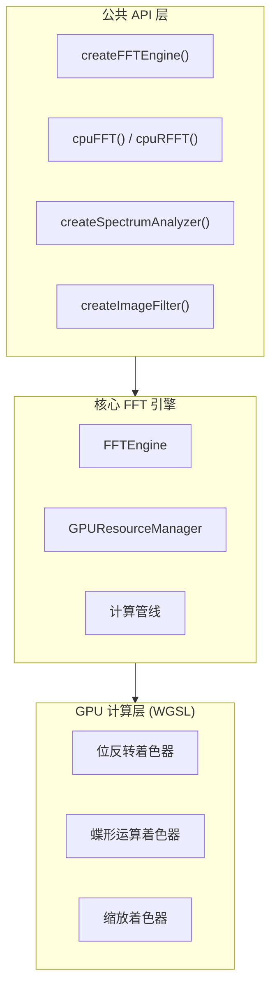

# 架构概览

WebGPU FFT 库实现了一个聚焦的 FFT 架构：核心变换引擎面向 WebGPU，而频谱分析和图像滤波等应用工具仍以 CPU 为基础。

## 高层架构



## 关键设计决策

### 1. Cooley-Tukey Radix-2 DIT 算法

- 复杂度 $O(N \log N)$，对比朴素 DFT 的 $O(N^2)$
- 规整的内存访问模式适合 GPU 并行化
- 要求输入尺寸为 2 的幂

### 2. GPU / CPU 双 FFT 实现

- GPU 路径追求最大性能（需要 WebGPU）
- CPU 回退保证无 WebGPU 环境也能运行
- 应用工具调用 CPU 路径，不暗示 GPU 原生处理

### 3. 共享内存 Bank Conflict Padding

- 可选的 padding 可减少蝶形运算期间的 bank conflict
- 32 bank 场景下约 3% 的内存开销
- 性能收益因 GPU 架构而异

## 详细 RFC

完整技术设计请参见：

- [RFC 0001：WebGPU FFT 库架构](https://github.com/LessUp/gpu-fft/blob/main/openspec/specs/rfc/0001-webgpu-fft-library-architecture.md)
- [RFC 0002：项目质量提升](https://github.com/LessUp/gpu-fft/blob/main/openspec/specs/rfc/0002-project-quality-enhancement-architecture.md)

## 项目结构

```
gpu-fft/
├── openspec/
│   ├── specs/              # 仓库级规范真源
│   │   ├── product/        # 产品需求
│   │   ├── rfc/            # 技术设计文档
│   │   ├── api/            # API 规范
│   │   └── testing/        # 测试策略
│   └── changes/            # 提案 / 设计 / 任务产物
├── docs/                   # 文档站点源码 (VitePress)
│   ├── setup/              # 配置与工具指南
│   ├── tutorials/          # 用户教程
│   ├── architecture/       # 架构文档
│   └── api/                # API 参考源页面
├── src/                    # 源代码
│   ├── core/               # 核心 GPU 引擎
│   ├── shaders/            # WGSL 着色器源码真源
│   ├── utils/              # CPU 工具函数
│   ├── apps/               # 应用级 API
│   └── types.ts            # 类型定义
├── tests/                  # 测试套件
├── examples/               # 代码示例
│   ├── node/               # TypeScript 示例
│   └── web/                # HTML/JS 演示
└── benchmarks/             # 性能基准
```

## 规范作为真源

所有仓库级需求定义于 `openspec/specs/`：

| 规范类型 | 位置 | 用途 |
|----------|------|------|
| 产品 | `openspec/specs/product/` | 构建什么（需求、用户故事） |
| RFC | `openspec/specs/rfc/` | 如何构建（架构、设计决策） |
| API | `openspec/specs/api/` | 接口契约（类型、方法） |
| 测试 | `openspec/specs/testing/` | 验证策略（属性、覆盖率） |
